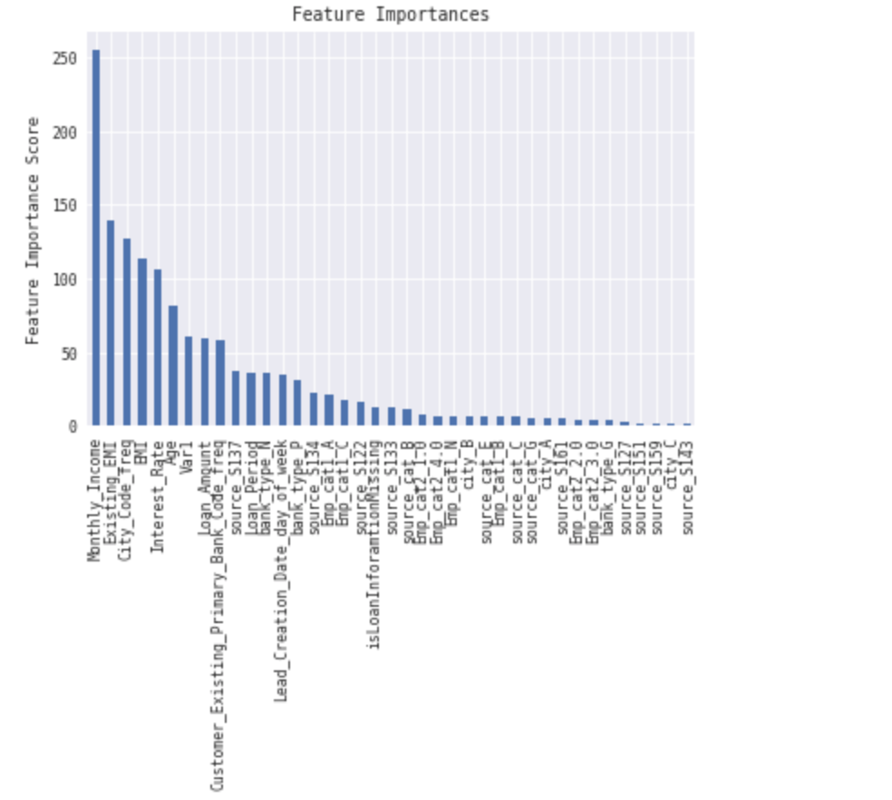

# McKinsey-Analytics-Online-Hackathon
This repository contains my solution of problem, provided during McKinsey Analytics Online Hackathon

## Problem Statement

A digital arm of a bank faces challenges with lead conversions. The primary objective of this division is to increase customer acquisition through digital channels. The division was set up a few years back and the primary focus of the division over these years has been to increase the number of leads getting into the conversion funnel.

They source leads through various channels like search, display, email campaigns and via affiliate partners. As expected, they see differential conversion depending on the sources and the quality of these leads.

They now want to identify the leads' segments having a higher conversion ratio (lead to buying a product) so that they can specifically target these potential customers through additional channels and re-marketing. They have provided a partial data set for salaried customers from the last 3 months. They also capture basic details about customers. We need to identify the segment of customers with a high probability of conversion in the next 30 days.

## Data

Input variables:

1. ID - Unique ID (can not be used for predictions)
2. Gender - Sex of the applicant
3. DOB - Date of Birth of the applicant
4. Lead_Creation_Date - Date on which Lead was created
5. City_Code - Anonymised Code for the City
6. City_Category - Anonymised City Feature
7. Employer_Code - Anonymised Code for the Employer
8. Employer_Category1 - Anonymised Employer Feature
9. Employer_Category2 - Anonymised Employer Feature
10. Monthly_Income - Monthly Income in Dollars
11. Customer_Existing_Primary_Bank_Code - Anonymised Customer Bank Code
12. Primary_Bank_Type - Anonymised Bank Feature
13. Contacted - Contact Verified (Y/N)
14. Source - Categorical Variable representing source of lead
15. Source_Category- Type of Source
16. Existing_EMI - EMI of Existing Loans in Dollars
17. Loan_Amount - Loan Amount Requested
18. Loan_Period - Loan Period (Years)
19. Interest_Rate - Interest Rate of Submitted Loan Amount
20. EMI - EMI of Requested Loan Amount in dollars
21. Var1 - Categorical variable with multiple levels
22. Approved - (Target) Whether a loan is Approved or not (0/1)

## Evaluation Criteria

The Evaluation Criteria for this problem is AUC_ROC . Please note : Public leaderboard is based on 30% of the test dataset, while 70% of the dataset is used for Private Leaderboard.

## Results
The methods described in this file, helped me to reach the 4th place in private leaderboard with accuracy score of 0.8546735790

## Progress
### 1.Data cleaning.
1. Removed NaN, outliers detection, feature engineering
### 2. Random Forest Alrogithm
1. In a loop from 24 to 1500 with the step of 24, I found the proper number of trees, 800
2. Using grid, I found the max_depth parametr = 10
3. Tuned parametrs to overcome the imbalance of data source 
### 3. Extra Trees Classifier
Didn't worked welll. 
### 4.Logistic Regression
1. Converted categorical features to numeric.
2. Using Standatr Scaller normalize the data
3. Tried to find the uselss features by removing each of them in the loop. Didn't helped too much.
4. Tuned parametrs to overcome the imbalance of data source 
### 5. SVM
As SVM has O(n^2) complexity, it took me more than 2 hours on `'Intel(R) Core(TM) i5-5257U CPU @ 2.70GHz' to compute it.` I decided to stop it
### 6.XGBoost
1. Implemented the algorithm and tuned parametrs. The best result, which I used in a final submission is
`XGBClassifier(
 learning_rate =0.1,
 n_estimators=1000,
 max_depth=4,
 min_child_weight=4,
 gamma=0.3,
 subsample=0.8,
 colsample_bytree=0.8,
 reg_alpha=0.005,
 objective= 'binary:logistic',
 nthread=4,
 scale_pos_weight=1,
 seed=27)`

2. Feature importance

